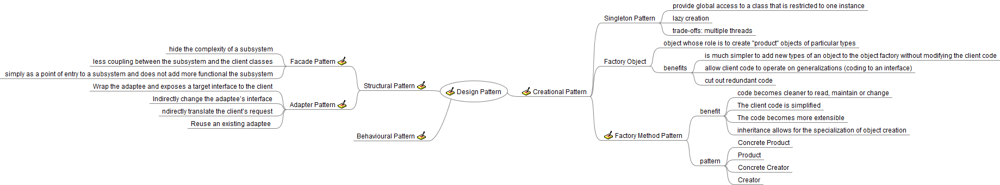

# Design Pattern

Notes from [Design Pattern](https://www.coursera.org/learn/design-patterns) course by University of Alberta.

* Module 1: [Introduction to Design Patterns: Creational & Structural Pattern](Module1/module1.md)
* Module 2: [Behavioural Design Patterns](Module2/module2.md)
* Module 3: [Working with Design Patterns & Anti-patterns](Module3/module3.md)

Here is the mind map of the course

