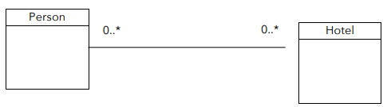
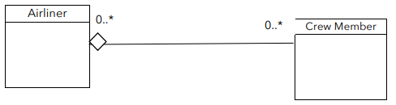
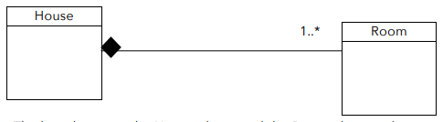
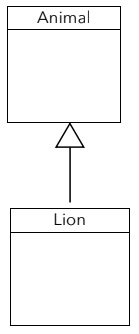
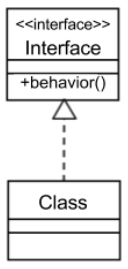

# Module 2 - Object-Oriented Modeling

## Creating Models in Design
It is important when working on a software development project not to jump right into creating code to solve the problem. Instead, making the right product involves understanding the full requirements of your product and using good design.

The design step falls between understanding your requirements and building the product. It iteratively deals with both the problem space and the solution space. The design should also present and describe concepts in a way that users and developers both understand, so they may discuss using common terms.

The goal during software design is to construct and refine *models* of all the objects of the software. Categories of objects involve:

* **entity objects**, where initial focus during the design is placed in the problem space
* **control objects** that receive events and co-ordinate actions as the process moves to the solution space
* **boundary objects** that connect outside services to your system, as the process moves towards the solution space

## Four Design Principles

### Abstraction
Abstraction breaks a concept down into a simplified description that ignores unimportant details and emphasizes the essentials needed for the concept, within some context.

An abstraction should follow the rule of **least astonishment**. This rule suggests that essential attributes and behaviours should be captured with no surprises and no definitions that fall beyond its scope. This prevents irrelevant characteristics from becoming part of an abstraction and helps to ensure that the abstraction makes sense for the concept's purpose.

Context or a specific perspective is critical when forming an abstraction.

The essential characteristics of an abstraction can be understood in two ways: through basic **attributes** and through basic **behaviours** or **responsibilities**.

### Encapsulation
There are three ideas behind encapsulation. These are:

* The ability to *bundle* attribute values (or data) and behaviours (or functions) that manipulate those values, into a self-contained object.
* The ability to *expose* certain data and functions of that object, which can be accessed from other objects, usually through an interface.
* The ability to *restrict* access to certain data and functions to only within the object.

As one of the ideas of encapsulation is restricting access to certain data and functions to only within an object, this naturally links encapsulation to **data integrity** and the security of sensitive information.

**Changeable implementation**: as the ability to “expose” data is separate from the “bundle” of attributes itself, this means that the implementation of attributes and methods can change, but the accessible interface of a class can remain the same.

Encapsulation achieves an **abstraction barrier** through black box thinking where the internal workings of a class are not relevant to the outside world. This results in an abstraction that reduces complexity for users of the class.

### Decomposition
It consists of taking a whole thing, and dividing it into different parts. Alternately, decomposition can also indicate taking separate parts with different functionalities and combining them to create a whole. Decomposition allows problems to broken into smaller pieces that are easier to understand and solve.

The general rule for decomposition is to look at the different responsibilities of a whole and evaluate how the whole can be separated into parts that each have a specific responsibility. Each of these parts are in fact separate objects that can be created from separate classes in your design.

### Generalization
In coding, algorithmic behaviours are often modelled through methods. A method allows a programmer to generalize a behaviour, so the behavior can be applied to different input data. This generality reduces the need to have identical code throughout a program.

In object-oriented modelling, generalization is a main design principle, but beyond creating a method that can be applied to different data, object-oriented modelling achieves generalization by classes through inheritance. In generalization we take repeated, common, or shared characteristics between two or more classes and factor them out into another class.

Both methods and inheritance exemplify the generalization design principle through the **D.R.Y.** or **Don’t Repeat Yourself rule**.

## Design Structure in Java and UML Class Diagrams

### Abstraction
The design principle of abstraction allows for the simplification of a concept to its essentials within some context.

Abstraction can be applied at the design level using UML class diagrams.

### Encapsulation
In a UML class diagram, encapsulation is expressed by having all of the object’s relevant data defined in attributes of the class, and by providing specific methods to access those attributes.

Encapsulation in UML class diagrams helps you determine the “gate” to controlling data, by using only public methods to access the data attributes of the class. For every piece of essential data, the use of public methods to access private data creates protection from unexpected direct change of that data. This preserves the **data integrity**.

### Decomposition
The design principle of decomposition takes a whole thing and divides it into different parts. It also does the reverse, and takes separate parts with different functionalities, and combines them to form a whole.

**Association** indicates a loose relationship between two objects, which may interact with each other for some time.

**Aggregation** is a “has-a” relationship where a whole has parts that belong to it. Parts may be shared among wholes in this relationship. Aggregation relationships are typically weak.

**Composition** is one of the most dependent of the decomposition relationships. This relationship is an exclusive containment of parts, otherwise known as a strong “has-a” relationship. In other words, a whole cannot exist without its parts, and if the whole is destroyed, then the parts are destroyed too.

### Generalization

The design principle of generalization takes repeated, common, or shared characteristics between two or more classes and factors them out into another class, so that code can be reused, and the characteristics can be inherited by subclasses.

**Implementation Inheritance**: in Java, only single implementation inheritance is allowed. This means that while a superclass can have multiple subclasses, a subclass can only inherit from a single superclass (**extends relationship**).

**Data ambiguity**: if a subclass inherits from two or more superclasses that have attributes with the same name or behaviours with the same method signature, then it is not possible to distinguish between them. As Java cannot tell which one is referenced, so it does not allow for multiple inheritance to prevent data ambiguity.

Java addresses the restriction of single implementation inheritance by offering **interface inheritance**, another form of generalization (**implements relationship**). 

Like abstract classes, interfaces are a means in which you can achieve **polymorphism**: when two classes have the same description of a behaviour, but the implementations of that behaviour may be different.

In Java, a class can implement as many interfaces as desired. This is because interfaces are only *contracts* and they do not enforce a specific way to complete these contracts, so overlapping method signatures are not a problem.

## Assignment 1

[Here](Assignment1.md) is the assignment and my solution.

## Capstone Assignment 1.1

[Here](CapstoneAssignment1.1.md) is the assignment and my solution.
