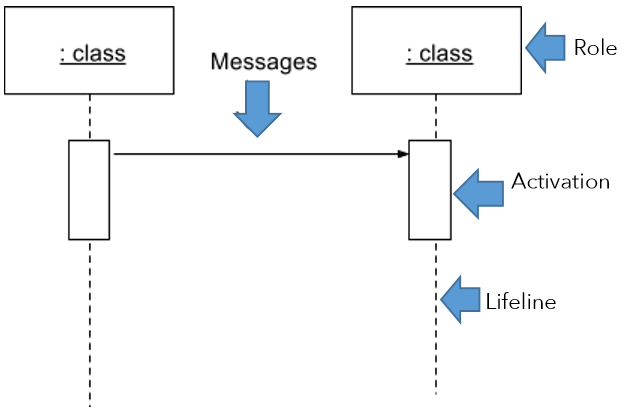
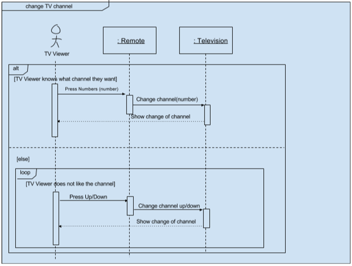
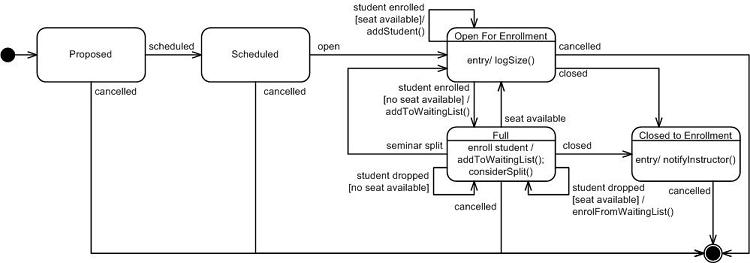

# Module 3 - Design Principles

## Evaluating Design Complexity

It is important to keep modules simple when you are programming. The metrics often used to evaluate design complexity are **coupling** and **cohesion**.

### Coupling

**Coupling** focuses on complexity between a module and other modules.

* If a module is too reliant on other modules, then it is *tightly coupled* to others. This is a bad design.
* If a module finds it easy to connect to other modules through well-defined interfaces, it is *loosely coupled* to others. This is good design.  

The metrics to consider are:  

* **Degree** - the number of connections between the module and others. The degree should be small for coupling.
* **Ease** - how obvious are the connections between the module and others. Connections should be easy
* **Flexibility** - how interchangeable the other modules are for this module. Other modules should be easily replaceable

### Cohesion

**Cohesion** focuses on complexity within a module, and represents the clarity of the responsibilities of a module.

A module that performs one task and nothing else, or that has a clear purpose, has *high cohesion*. A good design has high cohesion. If an encapsulation has to be broken to understand a method, or if the module has an unclear purpose, it has *low cohesion*.

## Separation of Concerns

A **concern** is a very general notion: it is anything that matters in providing a solution to a problem. Separation of concerns is about keeping the different concerns in your design separate.

Separation of concerns provides many advantages.

* allow you to develop and update sections of the software independently.
* you do not need to know how all sections of code work in order to update a section.
* allows changes to be made to one component without requiring a change in another.

## Information Hiding

Modules should only have access to the information it needs to do its job. Limiting information to modules so that only the minimum amount of information is needed to use them correctly and to "hide" everything else is done through **information hiding**.

Information hiding is closely associated with encapsulation and can be accomplished through the use of *access modifiers*.

## Conceptual Integrity

**Conceptual integrity** entails making decisions about the design and implementation of a software system, so even if multiple people work on it, it would seem cohesive and consistent as if only one mind was guiding the work.

There are multiple ways to achieve conceptual integrity:

* communication
* code reviews
* using certain design principles and programming constructs
* having a well-defined design or architecture underlying the software
* unifying concepts
* having a small core group that accepts each commit to the code base.

## Generalization Principles

In this course reviewed the four design principles of abstraction, encapsulation, decomposition, and generalization. Generalization and inheritance are some of the more difficult topics to master in object-oriented programming and modelling.

In order to identify if inheritance is being misused, it is good practice to keep a couple of generalization principles in mind.  

One principle can be formulated as a question to ask yourself about whether a subclass should exist: "Am I using inheritance to simply share attributes or behaviour without further adding anything special in my subclasses?" If the answer to this question is "yes," then inheritance is being misused, as there is no point for the subclasses to exist. The superclass should already be enough.

Another technique is determining if the **Liskov substitution principle** is broken. The Liskov substitution principle states that a subclass can replace a superclass, if and only if, the subclass does not change the functionality of the superclass. This means that if a subclass replaces a superclass, but replaces all the superclass behaviours with something totally different, then inheritance is being misused.  

## Specialized UML class diagrams

### UML Sequence Diagrams

**Sequence diagrams** are used to show a design team how objects in a program interact with each other to complete tasks. In simple terms, a sequence diagram is like a map of conversations between different people, with the messages sent from person to person outlined.

Components of a sequence diagram:

An example of a sequence diagram. Scenario: the TV viewer is unsure what channel to go to and would like to surf channels until they pick one they like.

### UML State Diagrams

**State diagram** describes how systems behave and respond. They follow the states of a system or a single object and show changes between the states as a series of events occur in the system.

A **state** is the way an object exists at a particular point in time. The state of an object is determined by the values of its attributes.  

Example of state diagram for the Seminar class during registration. The rounded rectangles represent states: you see that instances of Seminar can be in the Proposed, Scheduled, Open For Enrollment, Full, and Closed to Enrollment states. An object starts in an initial state, represented by the closed circle, and can end up in a final state, represented by the bordered circle

## Model Checking

In addition to understanding techniques for designing a software system, it is important to know techniques for verifying the system. Some of these techniques include unit testing, beta testing, and simulations. Another one such technique is **model checking**, which is a systematic check of your system’s **state model** in all its possible states. Model checking helps find errors that other tests cannot.

Model checkers begin by generating a state model from your code. A **state model** is an abstract state machine that can be in one of various states. The model checker then checks that the state model conforms to be certain behavioural properties.

There are three different phases in model checking.  

1. The first is the **modelling phase**. During this phase, the model description is entered in the same programming languages as the system. Any desired properties are also described. This phase also performs **sanity checks**. Sanity checks are quick checks that should be easy to do, as they come from clear and simple logic. It is beneficial to test for these simple errors before using model checkers, so the focus can be on specifying the more complex properties to check. Sanity checks might include something as simple as turning the system on and off.  
2. The second phase is the **running phase**. The running phase is when the model checker is run to see how the model conforms to the desired properties described in the modelling phase.  
3. The third and final phase is the **analysis phase**. This phase is when all desired properties are checked to be satisfied, and if there are any violations. Violations are called **counterexamples**. The model checker should provide descriptions of violations in the system, so you can analyze how they occurred.