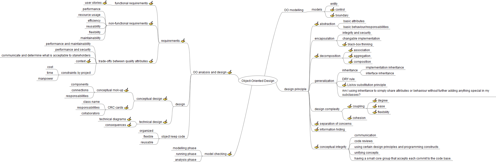

# Object-Oriented-Design

Notes from [Object-Oriented Design](https://www.coursera.org/learn/object-oriented-design/home/welcome) course by University of Alberta.

* Module 1: **Object-Oriented Analysis and Design** [here](Module1/Module1.md)
* Module 2: **Object-Oriented Modeling** [here](Module2/Module2.md)
* Module 3: **Design Principles** [here](Module3/Module3.md)

Here is the mind map of the course

